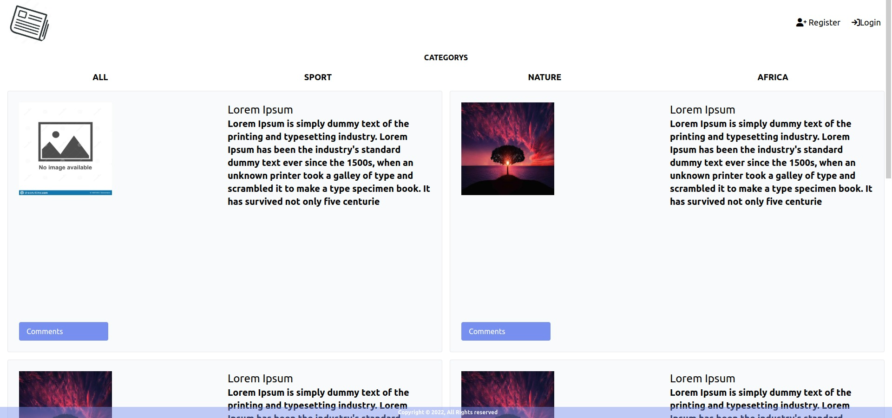
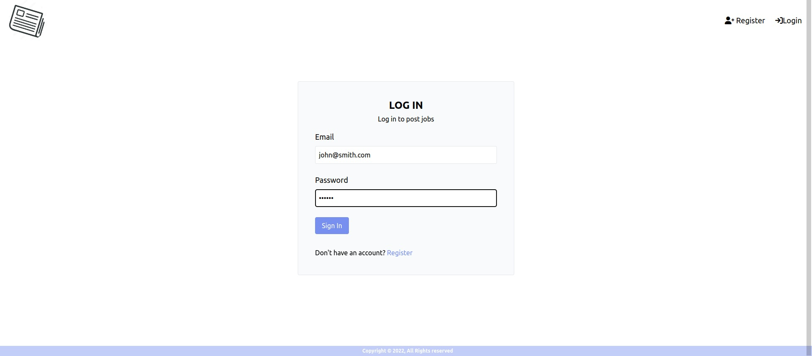
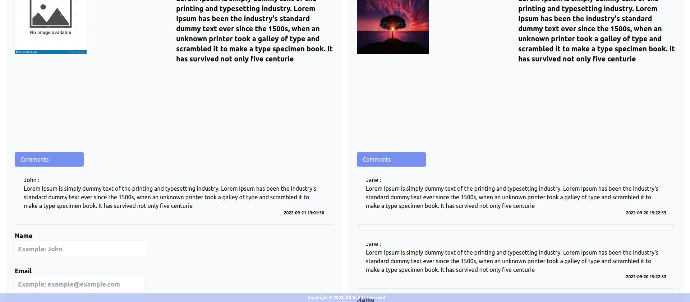
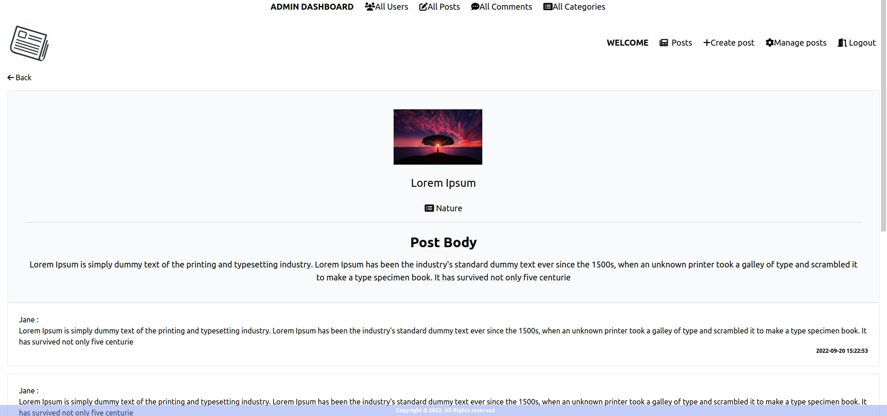
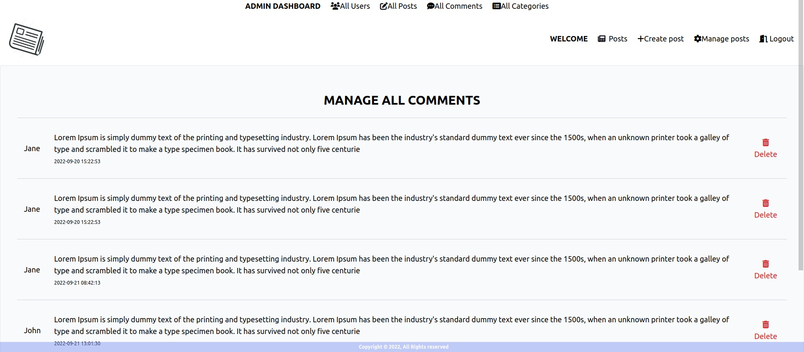

# News App

This application, built using PHP with Laravel framework and MySql, along with Alpine.js and jQuery, serves as a platform for posting and commenting with an integrated administration section. It's designed for demonstration purposes only.

## Features

### Public Main Page


### Login Page


### Comments Section


### Single Post View


### Admin Management Interface


## Requirements

- Git
- Code Editor (e.g., PHPStorm or any other)
- MySql (or any compatible database for data storage)
- PHP
- PHP Extensions for Laravel

## Installation Guide

### Setting Up

1. **Clone the Repository**: 

       Clone or download the repository to your desired directory.

2. **Open Terminal in Directory**: 

        Ensure the terminal is opened at the root of the chosen directory.

3. **Code Editor Setup**: 

        Open the directory with your preferred code editor.

4. **Environment Configuration**: 

        Rename `.env.example` file at the root to `.env`. Then, update the `.env` file with or without your database credentials:
   
    DB_HOST=your_mysql_ip_address

    DB_DATABASE=your_databases_name

    DB_USERNAME=your_mysql_username

    DB_PASSWORD=your_mysql_password
5. **Install Dependencies**: 

    Run `./vendor/bin/sail composer install`. If there are any requirement issues, use `composer install --ignore-platform-reqs`.

6. **Generate Application Key**:

    `./vendor/bin/sail artisan key:generate`

7. **Database Migration**: 

    Execute `./vendor/bin/sail artisan migrate` to create necessary tables and columns in your database.

8. **Database Seeding**: 

    Populate the database with initial data using `./vendor/bin/sail artisan migrate artisan db:seed`.

9.**Visit the Application**:
    
    Then, navigate to the address indicated in the terminal (default: `http://127.0.0.1:8000`).

10.**Accessing the Application**:

 - **Register**: To create posts, register on the registration page.
 - **Demo Admin Account**: For admin access, use the following credentials:

    ```
   Email: john@smith.com
   Password: 123456
   ```

    Alternatively, set admin mode in the users table by changing the `isAdmin` field.

### Default Resources

- Favicon and Navigation Icon: `public/images/newsicon.png`
- Placeholder Image for Missing Images: `public/images/no-image.jpg`

## Usage

Enjoy the functionality of the News App, including creating posts, commenting, and managing content through the admin panel.

---

**Note**: This application is intended for demonstration purposes and not for production use.
